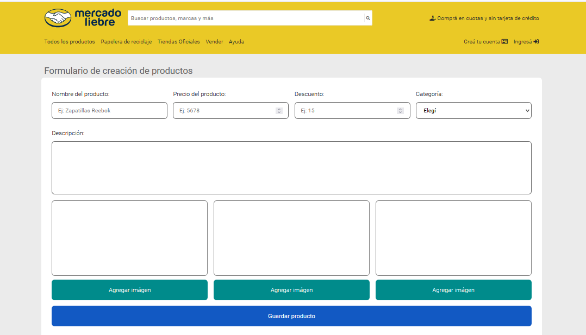

# MERCADO LIEBRE - MVC v14
> Developed by Eric for Comisión 14 | Fundación Formar
## Indice
- Mercado Liebre v14
  - [Indice](#indice)
    - [Información General](#información-general)
    - [Screenshot](#screenshot)
  - [Dependencias](#dependencias)
  - [Instalación](#instalación)
  - [Base de datos](#base-de-datos)
### Información General
***
Sitio creado con Node y Express en el ámbito del curso de Fullstack Web de Fundación Formar y Digital House. 
### Screenshots





## Dependencias
Dependencias utilizadas en el proyecto:

    - [bcryptjs](https://www.npmjs.com/package/bcryptjs): "^2.4.3",
    - [cookie-parser](https://www.npmjs.com/package/cookie-parser): "~1.4.4",
    - [debug](https://www.npmjs.com/package/debug): "~2.6.9",
    - [dotenv](https://www.npmjs.com/package/dotenv): "^10.0.0",
    - [ejs](https://www.npmjs.com/package/ejs): "~2.6.1",
    - [express](https://www.npmjs.com/package/express): "~4.16.1",
    - [express-session](https://www.npmjs.com/package/express-session): "^1.17.2",
    - [express-validator](https://www.npmjs.com/package/express-validator): "^6.14.0",
    - [http-errors](https://www.npmjs.com/package/http-errors): "~1.6.3",
    - [method-override](https://www.npmjs.com/package/method-override): "^3.0.0",
    - [morgan](https://www.npmjs.com/package/morgan): "~1.9.1",
    - [multer](https://www.npmjs.com/package/multer): "^1.4.4",
    - [mysql2](https://www.npmjs.com/package/mysql2): "^2.3.3",
    - [sequelize](https://www.npmjs.com/package/sequelize): "^6.12.5",
## Instalación

Clonar el proyecto e instalar las dependencias
```
$ git clone https://github.com/Comision14/mercadoLiebre14
$ cd mercadoLiebre14
$ npm install

```
Crear el arhivo <code>.env</code> y darle valor a las variables de entorno según corresponda.
```
DB_USERNAME=
DB_PASSWORD=
DB_DATABASE=mercadoLiebre_db14
DB_PORT=3306
DB_HOST=127.0.0.1

NODE_ENV=development
PORT=3000
```
## Base de datos
***
### Crear la base de datos con **migraciones**
Es necesario tener instalado [sequelize-cli](https://www.npmjs.com/package/sequelize-cli)
```
$ npm install --save-dev sequelize-cli
```
Crear la base de datos
```
$ sequelize db:create
```
Correr migraciones y seeders
```
$ sequelize db:migrate
$ sequelize db:seed:all
```